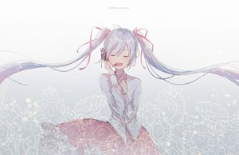

## 基于生成对抗网络的动漫头像生成

使用：

- win10 + anoconda
- anoconda promp
- cuda

### 1-环境要求

- python3.8
- pytorch1.7
- torchnet
- tqdm
- visdom

### 2-训练

#### 数据集

使用`spader.py`爬取二次元图像：

```python
python spader.py
```

二次元图片是从这个网站上爬下来的：[konachan](http://konachan.net) ，一共11263张，示例如下：



爬取的图片会自动保存在文件夹IMAGES。

然后使用`cropFace.py`剪切头像：

```python
python cropFace.py
```

剪裁出的二次元头像自动保存在`FaceData/FaceData/`文件夹。二次元头像示例：


可以从网盘下载：[二次元头像数据](链接: https://pan.baidu.com/s/1U5wD2ahRSazLwxiq4yqdnA) 提取码: cigh

至此，数据准备完毕。

#### 训练

打开2个anoconda prompt :

一个用于启动 visdom： 

```python
python -m visdom.server
```

一个用于训练：

超参数设置在`train.py`中的`Config()`中，可以使用默认参数。训练模型，执行：

```python
python train.py
```

每过一定epoch，会自动保存模型和生成的图片。

浏览器输入：http://localhost:8097/ ，页面如下：


如果不需要训练过程可视化，则将train.py中Config中的vis设置为False即可。

### 3-生成图片

生成器和判别器的权重文件下载：[netd-netd](链接: https://pan.baidu.com/s/1TNC1cwzLjdGOfU9U8WkV9g) （ 提取码: hdb9）。放在checkpoints文件夹下。

执行：

```python
python generate.py
```

效果如下。


### Reference

[1]	https://github.com/wmylxmj/DCGAN-Head-Portrait-Generator

[2]	https://zhuanlan.zhihu.com/p/33565815

